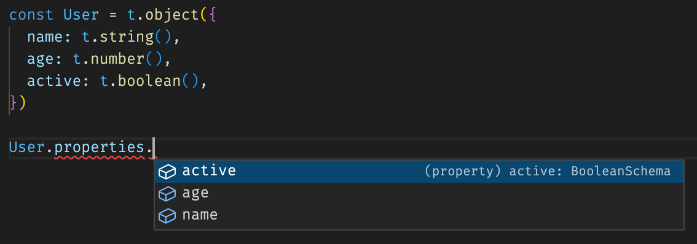
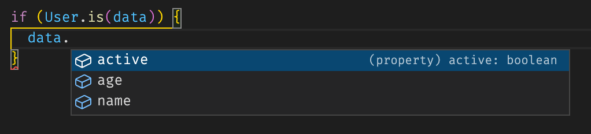

# type-io

Typescript-first schema declaration and validation library. Heavily inspired from [io-ts](https://www.npmjs.com/package/io-ts) for its codec and [joi](https://www.npmjs.com/package/joi) for schema declaration.

**`type-io` is still in alpha. Expect bugs and api changes!**

## Features

- Typescript-first library which support type inference and schema type properly.
- Support class-based or schema-based declaration
- Powerful schema declaration, can be used to type-guard and validation. Can also be reused for multiple use case such as json, bson, or other
- Type coercion, allow data transformation from/to different type for input/output.
- Fast and Extensible, build your own schema/codec/parser

Please see the [documentation](#docs) for more details.

## Docs

- [The Idea](../../docs/pages/01-the-idea.md)
- [Getting Started](../../docs/pages/02-getting-started.md)
  - [Installation](../../docs/pages/02-getting-started.md#installation)
  - [Basic Usage](../../docs/pages/02-getting-started.md#basic-usage)
- [Schema-based declaration](../../docs/pages/03-schema.md)
- [Class-based declaration](../../docs/pages/04-class.md)
- [Parser](../../docs/pages/05-parser.md)
- [Codec](../../docs/pages/06-codec.md)
